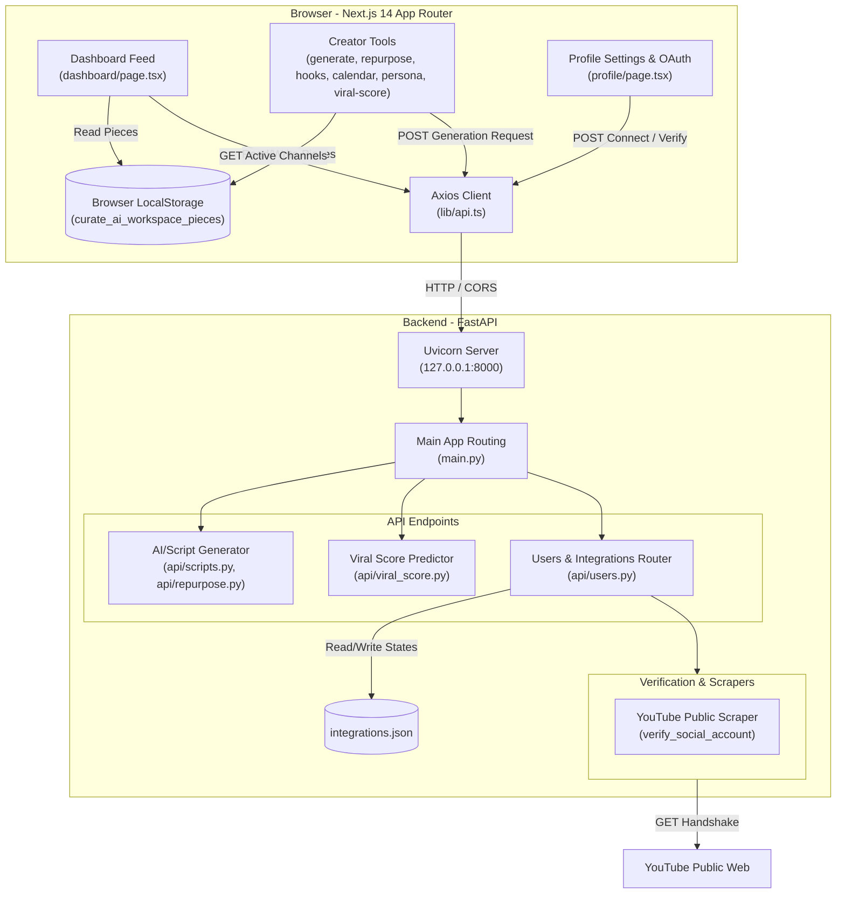

# 🌌 Curate AI: Content Creation Workspace

Curate AI is a premium, high-performance content creation and management workspace designed for modern creators. It features advanced AI generation workflows, calendar scheduling, performance/viral predictability metrics, audience personas, and seamless social channel integrations, all wrapped in a visually stunning interface with custom animations and micro-interactions.

---

## ✨ Features & User Experience

*   **⚡ Premium Micro-Interactions**: Smooth spring hover states, tab-slide selectors, page transitions, and simulated OAuth consent overlays built using Framer Motion.
*   **📊 Creator Dashboard Feed**: Staggered card introductions, metric count-ups, and live session updates populated dynamically.
*   **✍️ Create Content Generator**: Multi-step typewriter-style script reveals, progress loading bars, and interactive copy features.
*   **🔄 Content Repurposer**: Multi-format converters with custom pulse skeleton layout states.
*   **🎯 Hook Scorer**: AI diagnostic analysis for copywriting hooks with visual performance indicators.
*   **📅 Content Production Calendar**: Staggered day blocks, item status scales, and animated details drawers.
*   **👤 Audience Persona Dossiers**: Segmented profiles with smooth hover elevations and diagnostic pulse layouts.
*   **🔥 Viral Score Predictor**: Radial progress ring gauges showing overall script viability score dynamically.
*   **🔒 Auth & Integrations**: Animated SVG network core login animations, secure simulated OAuth channels, and verification checks.

---

## 🏗️ Architecture Overview

The workspace is split into a Next.js App Router frontend and a FastAPI backend.



---

## 🚀 Tech Stack

### Frontend
*   **Framework**: Next.js 14 (App Router, React 18, TypeScript)
*   **Styling**: Tailwind CSS, CSS Variables for HSL palettes, Glassmorphic effects
*   **Animations**: Framer Motion (respects reduced motion preferences), React CountUp
*   **Utility & UI Components**: Sonner (toasts), Lucide React (icons), Axios

### Backend
*   **Framework**: FastAPI (Python 3.10+)
*   **Server**: Uvicorn (ASGI server)
*   **Utilities**: BeautifulSoup4 (for social page scraping/validation)
*   **Persistence**: Flat-file JSON database (`integrations.json`)

---

## 🛠️ Local Development & Setup

### Prerequisites
*   Node.js 18+ & npm
*   Python 3.10+ & `pip`

---

### 1. Setting up the Backend

1. Navigate to the root directory.
2. Create and activate a python virtual environment:
   ```bash
   python -m venv venv
   # On Windows:
   .\venv\Scripts\activate
   # On macOS/Linux:
   source venv/bin/activate
   ```
3. Install required Python packages:
   ```bash
   pip install -r requirements.txt
   ```
4. Start the FastAPI server:
   ```bash
   python main.py
   ```
   *The backend server will run at `http://127.0.0.1:8000`.*

---

### 2. Setting up the Frontend

1. Navigate to the `frontend/` directory:
   ```bash
   cd frontend
   ```
2. Install npm dependencies:
   ```bash
   npm install
   ```
3. Run the development server:
   ```bash
   npm run dev
   ```
   *The frontend workspace will run at `http://localhost:3000`.*

4. Build for production:
   ```bash
   npm run build
   ```

---

## 📝 Configuration & API Integration
*   The application includes pre-configured APIs connecting the frontend and backend.
*   CORS rules on the FastAPI server allow queries from the standard local development URL (`http://localhost:3000`).
