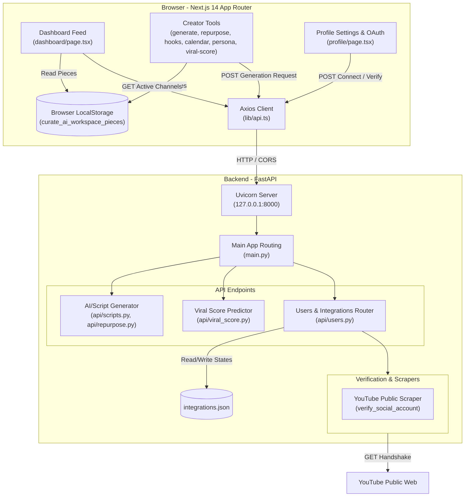

# 🌌 Curate AI: Creator Workspace

Curate AI is a premium, high-performance content creation and management workspace designed for modern creators. It features advanced AI generation workflows, calendar scheduling, performance/viral predictability metrics, audience personas, and seamless social channel integrations, all wrapped in a visually stunning interface with custom animations and micro-interactions.

---

## 🎨 Design System & Visual Aesthetics

Curate AI uses a premium, modern visual language inspired by glassmorphic layouts and dark-mode aesthetics. Key design features include:
*   **Color Palette**: Rich, tailored HSL color tokens utilizing deep background colors, lavender primary tones (`#a855f7`), and bright details.
*   **Typography**: Clean sans-serif lettering utilizing structured headings and optimized line height.
*   **Borders & Shadowing**: Glassmorphism elements defined by thin translucent borders (`rgba(255, 255, 255, 0.08)`) and custom deep-drop shadows to create depth.
*   **Micro-interactions**: Hover expansions, active spring button clicks, and tab sliders that glide smoothly.

---

## ✨ Workspace Features & Interactive Details

### 1. Unified Shell & Layout Navigation
*   **Sliding Menu Indicator**: A spring-based backdrop selector (`layoutId="active-nav-indicator"`) that glides between items as you change pages.
*   **Spring Taps**: Sidebar buttons utilize Framer Motion spring actions (`whileHover={{ scale: 1.02 }}`, `whileTap={{ scale: 0.98 }}`).
*   **Toast Notifications**: Global floating alerts powered by `Sonner` to confirm content copies, successful saves, and server updates.

### 2. Login & Authentication
*   **SVG Network Core**: Custom logo vector depicting gears and connection nodes that pulse and rotate continuously.
*   **Spring Scale Card**: The entry modal uses spring-scale entry effects (`y: 20` -> `0`, scale-in).

### 3. Creator Dashboard
*   **Count-Up Stats**: Metric cards roll stats up from `0` on initial load (powered by `react-countup`).
*   **Staggered Feed Entrance**: Feed items load in a staggered layout, fading and sliding up sequentially.
*   **Session-First Glow**: Brand-new content items are introduced with a lavender scale expansion and glow animation.

### 4. Create Content Generator
*   **Multi-Step Progress Line**: Status text changes dynamically as scripts generate.
*   **Typewriter Word-by-Word Reveal**: Custom script visualizer that prints output word-by-word at a speed of 20ms per word.

### 5. Content Repurposer
*   **Pulse Skeletons**: Dynamic, pulsing loading skeleton containers matching layout aspect ratios while API fetches process.

### 6. Hook Scorer
*   **Diagnosis Pulse Loader**: Full-card diagnostic overlays that pulse during copywriting audits.
*   **Spring Score Fills**: Score progress bars animate their width from `0%` to their target using custom spring values.

### 7. Content Calendar
*   **Checkmark Scales**: Selection checkmarks use spring-expansion scales (`0` -> `1.1` -> `1.0`) when clicked.
*   **Drawer Modal**: Slide-out calendar details modal utilizing `AnimatePresence` for exit animations.

### 8. Audience Persona Dossiers
*   **Dossier Hover Scales**: Cards expand subtly on hover (`y: -4`) with custom shadows.
*   **Diagnostic Pulse Skeleton**: Skeleton layout structures matching header grids.

### 9. Viral Predictor
*   **Radial Gauge Fills**: Circular rings utilizing `strokeDashoffset` transition calculations to match count-up scores.
*   **Glow Effects**: Radial shadows changing colors dynamically based on high, medium, or low viral viability scores.

### 10. Settings & Channel Integrations
*   **Simulated OAuth Modal**: Scale-in backdrop fades and consent screen transitions.
*   **Credit Indicators**: Custom scale metrics showing API limits and usage bars.

---

## 🏗️ Architecture Overview

Curate AI is split into a Next.js 14 App Router frontend client and a Python FastAPI backend.



---

## 💾 Data & Persistence Schemas

### 1. Flat-File Database (`integrations.json`)
The backend persists connected accounts in a local JSON structure. Each social network profile keeps state of connection variables and follower counts:
```json
{
  "youtube": {
    "connected": true,
    "username": "anisha.980sahu@gmail.com",
    "followers": "47K"
  },
  "instagram": {
    "connected": false,
    "username": "",
    "followers": ""
  },
  "tiktok": {
    "connected": false,
    "username": "",
    "followers": ""
  },
  "twitter": {
    "connected": false,
    "username": "",
    "followers": ""
  },
  "linkedin": {
    "connected": false,
    "username": "",
    "followers": ""
  }
}
```

### 2. Browser LocalStorage Workspace Pieces (`curate_ai_workspace_pieces`)
Workspace pieces generated inside tool views are stored directly in `localStorage` to display in the main Dashboard feed feed.
```typescript
interface WorkspacePiece {
  id: string;          // Timestamp string
  title: string;       // User topic/prompt
  platform: string;    // 'youtube' | 'instagram' | 'tiktok' | etc.
  type: string;        // 'Script Generator' | 'Content Repurposer' | etc.
  status: string;      // 'Optimized' | 'Pending'
  score: string;       // Predictability score percentage (e.g. '92%')
  date: string;        // Formatted timestamp (e.g. 'Just now')
  description: string; // Generation preview text
}
```

---

## 🔌 API Endpoints Reference

All API calls prefix from base URL `/api/v1`.

### 1. User & Integrations Management
*   **`GET /users/integrations`**: Returns a list of current active and inactive connected networks.
*   **`POST /users/integrations/verify`**: Verifies and links a brand channel.
    *   *Body*: `{"platform": "youtube", "username": "@creator_handle"}`
    *   *Response*: `{"connected": true, "username": "@creator_handle", "followers": "120K"}`
    *   *Logic*: The backend will scrape the YouTube public URL `https://www.youtube.com/@creator_handle` to verify channel existence and extract its follower count.
*   **`POST /users/integrations/disconnect`**: Clears connection attributes inside `integrations.json`.
    *   *Body*: `{"platform": "youtube"}`

### 2. AI Generator
*   **`POST /scripts/generate`**: Processes content topic requests.
    *   *Body*: `{"topic": "Artificial Intelligence", "platform": "youtube"}`
    *   *Response*: `{"script": "Full script draft text..."}`

### 3. Content Repurposer
*   **`POST /repurpose/generate`**: Transforms source text to match other platform formats.
    *   *Body*: `{"content": "Source text to transform", "platform": "instagram"}`
    *   *Response*: `{"repurposed": "Transformed platform-specific text"}`

### 4. Hook Generator
*   **`POST /hooks/score`**: Rates hook strength and drafts high-performing copies.
    *   *Body*: `{"topic": "Product launch"}`
    *   *Response*: `{"hooks": [{"hook": "Draft Hook 1", "score": 90}]}`

### 5. Content Calendar
*   **`GET /calendar/events`**: Returns list of scheduled content logs.
*   **`POST /calendar/events`**: Creates a calendar schedule event.

---

## 🏃‍♀️ UI/UX Motion Framework (Framer Motion)

The frontend utilizes dynamic motion components with standard spring parameters to maintain clean transitions:

```typescript
// Standard page transitions
export const pageTransitionVariants = {
  initial: { opacity: 0, y: 15 },
  animate: { opacity: 1, y: 0, transition: { duration: 0.45, ease: "easeOut" } },
  exit: { opacity: 0, y: -15, transition: { duration: 0.35, ease: "easeIn" } }
};

// Accessible Reduced Motion check
import { useReducedMotion } from "framer-motion";
const shouldReduceMotion = useReducedMotion();
const variants = shouldReduceMotion 
  ? { ...pageTransitionVariants, initial: { opacity: 0 }, exit: { opacity: 0 } } 
  : pageTransitionVariants;
```

---

## 🚀 Tech Stack

### Frontend
*   **Framework**: Next.js 14 (App Router, React 18, TypeScript)
*   **Styling**: Tailwind CSS, CSS Variables for HSL palettes, Glassmorphic effects
*   **Animations**: Framer Motion (respects reduced motion preferences), React CountUp
*   **Utility & UI Components**: Sonner (toasts), Lucide React (icons), Axios

### Backend
*   **Framework**: FastAPI (Python 3.10+)
*   **Server**: Uvicorn (ASGI server)
*   **Utilities**: BeautifulSoup4 (for social page scraping/validation)
*   **Persistence**: Flat-file JSON database (`integrations.json`)

---

## 🛠️ Local Development & Setup

### Prerequisites
*   Node.js 18+ & npm
*   Python 3.10+ & `pip`

---

### 1. Setting up the Backend

1. Navigate to the root directory.
2. Create and activate a python virtual environment:
   ```bash
   python -m venv venv
   # On Windows:
   .\venv\Scripts\activate
   # On macOS/Linux:
   source venv/bin/activate
   ```
3. Install required Python packages:
   ```bash
   pip install -r requirements.txt
   ```
4. Start the FastAPI server:
   ```bash
   python main.py
   ```
   *The backend server will run at `http://127.0.0.1:8000`.*

---

### 2. Setting up the Frontend

1. Navigate to the `frontend/` directory:
   ```bash
   cd frontend
   ```
2. Install npm dependencies:
   ```bash
   npm install
   ```
3. Run the development server:
   ```bash
   npm run dev
   ```
   *The frontend workspace will run at `http://localhost:3000`.*

4. Build for production:
   ```bash
   npm run build
   ```
